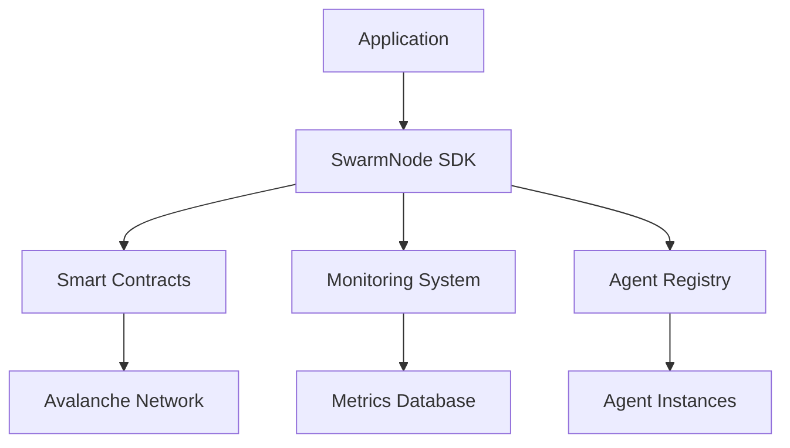

# Introduction à SwarmNode Protocol

Welcome to the interactive documentation of **SwarmNode Protocol**! 🎉

SwarmNode is a revolutionary infrastructure for deploying autonomous AI agents on the Avalanche blockchain, combining advanced artificial intelligence with blockchain security and decentralization.

## What is SwarmNode?

SwarmNode Protocol allows developers to:

- **Deploy autonomous AI agents** that can interact with DeFi protocols
- **Create collaborative agent networks** for complex tasks
- **Monetize artificial intelligence** via smart contracts
- **Optimize performance** with real-time metrics

## Key Features

### 🤖 Autonomous AI Agents
```typescript
// Exemple de création d'agent
const agent = await swarmNode.createAgent({
  name: "DeFi Trader",
  type: "TRADING",
  parameters: {
    riskLevel: "MODERATE",
    maxTrade: ethers.utils.parseEther("100")
  }
});
```

### 🔗 Intégration Blockchain Native
- Smart contracts optimisés pour Avalanche
- Gestion automatique des transactions
- Sécurité cryptographique intégrée

### 📊 Monitoring en Temps Réel
- Métriques de performance détaillées
- Alertes automatiques
- Dashboards interactifs

### 🌐 Écosystème Ouvert
- SDK complet pour développeurs
- API REST et WebSocket
- Documentation interactive

## Démarrage rapide

1. **Installation du SDK**
   ```bash
   npm install @swarmnode/protocol
   ```

2. **Configuration**
   ```typescript
   import { SwarmNode } from '@swarmnode/protocol';
   
   const swarmNode = new SwarmNode({
     network: 'avalanche',
     apiKey: 'your-api-key'
   });
   ```

3. **Création de votre premier agent**
   ```typescript
   const agent = await swarmNode.createAgent({
     name: "Mon Premier Agent",
     type: "RESEARCH"
   });
   ```

## Architecture



## Prochaines étapes

- 📖 [Guide de démarrage](./getting-started/installation)
- 🛠️ [Référence API](../api)
- 💡 [Exemples pratiques](./examples)
- 🤝 [Contribuer au projet](./contributing)

## Support

Need help? Join our community:

- 💬 [Discord](https://discord.gg/swarmnode)
- 🐦 [Twitter](https://twitter.com/swarmnode)
- 📧 [Email](mailto:support@swarmnode.ai)
